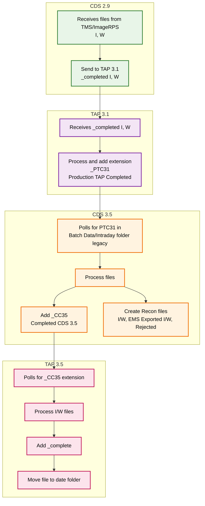

# Updated Data Processing Flow Diagram

```mermaid
graph TD
    subgraph "CDS 2.9"
        A[Receives files from TMS/ImageRPS<br/>I, W]
        A --> B[Send to TAP 3.1<br/>_completed I, W]
    end

    subgraph "TAP 3.1"
        C[Receives _completed I, W]
        C --> D[Process and add extension<br/>_PTC31<br/>Production TAP Completed]
    end

    subgraph "CDS 3.5"
        E[Polls for PTC31 in<br/>Batch Data/Intraday folder legacy]
        E --> F[Process files]
        F --> G[Add _CC35<br/>Completed CDS 3.5]
        F --> H[Create Recon files<br/>I/W, EMS Exported I/W, Rejected]
    end

    subgraph "TAP 3.5"
        I[Polls for _CC35 extension]
        I --> J[Process I/W files]
        J --> K[Add _complete]
        K --> L[Move file to date folder]
    end

    B --> C
    D --> E
    G --> I

    classDef cds29 fill:#e8f5e8,stroke:#2e7d32,stroke-width:2px,color:#000;
    classDef tap31 fill:#f3e5f5,stroke:#7b1fa2,stroke-width:2px,color:#000;
    classDef cds35 fill:#fff3e0,stroke:#ef6c00,stroke-width:2px,color:#000;
    classDef tap35 fill:#fce4ec,stroke:#c2185b,stroke-width:2px,color:#000;

    class A,B cds29;
    class C,D tap31;
    class E,F,G,H cds35;
    class I,J,K,L tap35;
```
